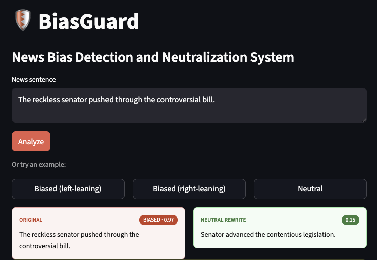

# BiasGuard-LLM-Based-News-Bias-Detection-and-Neutralization-System

An end-to-end NLP pipeline that detects political bias in news sentences, rewrites them into neutral language, and validates that the original meaning is preserved. 



---

## How It Works

```
Input sentence
    → BERT Bias Classifier
    → Rewrite via Mistral 7B (if bias_score > 0.5)
    → SBERT Similarity Check  ←──────────────┐
    → Re-score rewritten sentence             │
    → Output                    retry if sim < 0.80 (max 3x)
```

Five LangGraph nodes: **Input → Bias Classifier → Rewrite → Safety Check → Output**

---

## Project Structure

```
.
├── app.py                  # Streamlit demo frontend
├── app_helpers.py          # Pure formatting / threshold helpers used by app.py
├── src/
│   ├── pipeline.py         # LangGraph pipeline (main entry point)
│   ├── rewrite.py          # Mistral 7B rewrite via Ollama
│   ├── classifier.py       # TF-IDF baseline (training + inference)
│   ├── bert_classifier.py  # BERT fine-tuning on BABE
│   ├── compare_models.py   # BERT vs TF-IDF comparison (MLflow)
│   └── preprocessing.py    # Download BABE, clean, stratified split
├── tests/
│   ├── test_app_helpers.py
│   ├── test_bias_classifier_node.py
│   └── test_rewrite_node.py
├── notebooks/
│   └── Testing.ipynb       # Exploratory testing notebook
├── models/
│   ├── bert_classifier/    # Fine-tuned BERT checkpoint
│   └── tfidf_baseline/     # Pickled TF-IDF vectorizer + LR model
├── data/
│   ├── raw/babe.csv
│   └── processed/          # train.csv · val.csv · test.csv · split_summary.json
├── results/
│   └── rewrite_sample.xlsx # Sample rewrites for 20 biased sentences
├── requirements.txt
└── project_plan.md
```

---

## Run the project

**Prerequisites:** Python 3.10+, [Ollama](https://ollama.com).

```bash
# 1. clone and install
git clone https://github.com/beas28la/BiasGuard-LLM-Based-News-Bias-Detection-and-Neutralization-System.git
cd BiasGuard-LLM-Based-News-Bias-Detection-and-Neutralization-System
pip install -r requirements.txt

# 2. start Ollama and pull the rewrite model (one-time)
ollama serve &
ollama pull mistral:7b-instruct-v0.3-q4_K_M

# 3a. launch the Streamlit demo
streamlit run app.py
# → open http://localhost:8501

# 3b. or run the pipeline directly from the CLI
python src/pipeline.py
```

The Streamlit demo (`app.py`) loads the trained BERT classifier and SBERT once at startup, then lets you type a sentence or click an example to see the bias verdict, neutral rewrite, and supporting metrics side-by-side. Pure formatting and threshold helpers live in `app_helpers.py` and are unit-tested in `tests/test_app_helpers.py`.

---

## Usage

### Run the pipeline on a sentence

```python
import sys
sys.path.insert(0, "src")
from pipeline import run

result = run("The reckless senator pushed through the controversial bill.")
print(result)
```

Output:

```json
{
  "original": "The reckless senator pushed through the controversial bill.",
  "rewritten": "The senator advanced the bill.",
  "bias_label": "biased",
  "bias_score_before": 0.97,
  "bias_score_after": 0.15,
  "similarity": 0.84,
  "retries": 1,
  "warning": null
}
```

Or run directly from the repo root:

```bash
python src/pipeline.py
```

### Preprocess the dataset

Downloads BABE from HuggingFace, cleans text, and writes stratified 70/15/15 splits:

```bash
python src/preprocessing.py
```

Outputs: `data/raw/babe.csv`, `data/processed/{train,val,test}.csv`, `data/processed/split_summary.json`

### Train the classifiers

```bash
# TF-IDF baseline
python src/classifier.py

# Fine-tune BERT
python src/bert_classifier.py

# Compare BERT vs TF-IDF (logs to MLflow)
python src/compare_models.py
```

### Run tests

```bash
pytest tests/
```

---

## Dataset

**BABE** (`mediabiasgroup/BABE`, Spinde et al. 2022) — ~4,121 expert-annotated sentences, ~50/50 biased vs non-biased. Splits are stratified by `(label, outlet)`.

> The `type` column (left/center/right) reflects the *outlet's* AllSides rating, not a per-sentence annotation. The pipeline uses **binary classification only** (biased vs non-biased).

---

## Key Thresholds


| Parameter                     | Value |
| ----------------------------- | ----- |
| Bias classification threshold | 0.5   |
| SBERT similarity threshold    | 0.80  |
| Max retries                   | 3     |
| LLM temperature               | 0.3   |
| BERT learning rate            | 2e-5  |
| BERT epochs                   | 3     |


---

## Pipeline Architecture


| Node                     | Role                                                      |
| ------------------------ | --------------------------------------------------------- |
| **Input**                | Validates and normalizes input sentence                   |
| **Bias Classifier**      | BERT inference → `bias_score` + `bias_label`              |
| **Rewrite**              | Mistral 7B via Ollama rewrites if `bias_score > 0.5`      |
| **Safety Check**         | SBERT cosine similarity vs original; retries if < 0.80    |
| **Post-rewrite Scoring** | Re-runs BERT on rewritten sentence for `bias_score_after` |
| **Output**               | Assembles final result dict                               |


---

## Experiment Tracking

All training runs are logged to MLflow (experiment: `bias-detection`).

```bash
mlflow ui          # opens at http://localhost:5000
```

---

## References

- Spinde et al., "Neural Media Bias Detection Using Distant Supervision With BABE" (2022) — [HuggingFace](https://huggingface.co/datasets/mediabiasgroup/BABE)
- Devlin et al., "BERT: Pre-training of Deep Bidirectional Transformers for Language Understanding" (2019)
- Reimers & Gupta, "Sentence-BERT: Sentence Embeddings using Siamese BERT-Networks" (2019)
- [LangGraph](https://github.com/langchain-ai/langgraph) — pipeline orchestration
- [Mistral 7B Instruct](https://mistral.ai) via [Ollama](https://ollama.com)